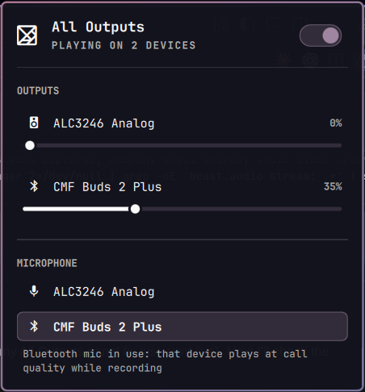

# All Outputs

Play sound on every connected output at once: laptop speakers, USB DAC,
Bluetooth earbuds, all of them together. A bar widget for Omarchy with an
on/off switch, a volume slider for each device, and a microphone picker.



## What it does

- **All at once.** Turn it on and everything you play goes to every output
  that is connected. New devices join as they connect. Bluetooth reconnects do
  not knock it off.
- **Per device volume.** Each output has its own slider. Set the earbuds low
  and the speakers high. The level is stored on the device, so it comes back
  when the device does.
- **Microphone picker.** Click any input to use it, Bluetooth included.
- **Master volume still works.** The bar's normal volume keys and the Audio
  panel slider move everything together and keep your per device balance.

## Requirements

Omarchy 4 with the Omarchy shell. It uses the PipeWire and WirePlumber that
ship with Omarchy, nothing else. No packages are installed and no elevated
privileges are needed.

## Install

```sh
omarchy plugin add https://github.com/zeeshan-origin/omarchy-all-outputs.git --enable
```

Then click the new icon in the bar and press **Set up**. That copies one file,
`~/.config/pipewire/pipewire.conf.d/10-all-outputs.conf`, and restarts audio
(playback pauses for a second). You can do the same from a terminal:

```sh
~/.config/omarchy/plugins/io.github.zeeshan-origin.all-outputs/setup/install.sh
```

If a file with that name already exists and is not ours, setup stops and tells
you. Run it with `--replace-existing` to back that file up and replace it.

## Use

Click the bar icon to open the panel. Right click the icon to toggle on/off
without opening it. In the panel, `b` or space toggles, `Esc` closes.

The same controls exist as a command, handy for keybinds:

```sh
P=~/.config/omarchy/plugins/io.github.zeeshan-origin.all-outputs/bin/all-outputs
$P status                 # what is playing where, and each device's volume
$P toggle                 # on <-> off, safe as a hotkey, never prompts
$P on                     # play on every output
$P off                    # play on one device (the one WirePlumber would pick)
$P off buds               # play only on the device matching "buds"
$P volume buds 60         # set a device to 60%
$P volume analog -10      # relative
$P volume buds mute       # toggle mute
$P mic                    # pick a microphone (interactive)
$P mic analog             # pick by name
$P mixer                  # a small terminal mixer, needs gum (Omarchy has it)
```

Device names are matched by any part of the name, case does not matter.

## How it works

It is a PipeWire combine sink named `combine_all_outputs`. The config gives it
a `priority.session` above every real device. Without that, WirePlumber
re-elects the default sink every time a device connects and a real device
always wins, so playback silently drops back to one device. That one line is
the difference between "works sometimes" and "works".

The combine sink feeds each device through a small stream. Those streams are
pinned at 100% so a device has exactly one volume: its own.

### About the Audio panel's Sources list

Omarchy's built in Audio panel lists every playback stream under Sources, and
the combine sink's per device streams show up there as identical rows called
"All Outputs output". PipeWire names them all the same and the panel cannot
tell them apart. They are harmless, but if you want them gone, clone the Audio
panel and hide them:

```sh
omarchy plugin clone omarchy.audio
```

Then in `~/.config/omarchy/plugins/<you>.audio/Panel.qml`, inside
`candidateStreams`, add one line next to the existing speaker tuning check:

```qml
if (String(n.name || "").indexOf("output.combine_all_outputs") === 0) continue
```

and run `omarchy restart shell`. The clone replaces the built in widget and
you can switch back at any time with `omarchy plugin enable omarchy.audio`.

## Uninstall

```sh
~/.config/omarchy/plugins/io.github.zeeshan-origin.all-outputs/setup/uninstall.sh
omarchy plugin remove io.github.zeeshan-origin.all-outputs
```

The uninstaller removes the PipeWire config only if it is still the exact file
it installed, puts your backed up original back if there was one, and restarts
audio. It never touches anything it did not create.

If it finds the config changed, replaced or symlinked, it leaves that file alone
and keeps its own record and your backup too, and prints the path to the backup,
so your original is always recoverable. Only once your original is back in place
(or there was never one to back up) does it drop
`~/.local/state/io.github.zeeshan-origin.all-outputs`.

## What it touches

| | |
|---|---|
| Writes | `~/.config/pipewire/pipewire.conf.d/10-all-outputs.conf` (only on Set up, with consent), and a record of that under `~/.local/state/io.github.zeeshan-origin.all-outputs/` |
| Runs | `pactl`, `wpctl`, `pw-dump`, `jq`, and Omarchy's own audio helpers (`omarchy-audio-output-set-default`, `omarchy-audio-input-set-default`, `omarchy-audio-sink-availability`, `omarchy-restart-audio`, `omarchy-osd`) |
| Network | none |
| Privileges | none |

Setup is capped with a timeout so a stuck audio restart cannot hang the panel.

## Known limits

- A Bluetooth headset cannot do high quality playback and its microphone at
  the same time. While something records through it, that device plays at
  call quality. The panel says so when it applies.
- Clicking a device in the built in Audio panel, or the Omarchy output switch
  keybind, moves the default to that one device. That is what they are for.
  Flip the switch here to go back to everything.

## License

MIT, see [LICENSE](LICENSE). The label helpers in `Model.js` are adapted from
Omarchy's own audio panel (MIT).
